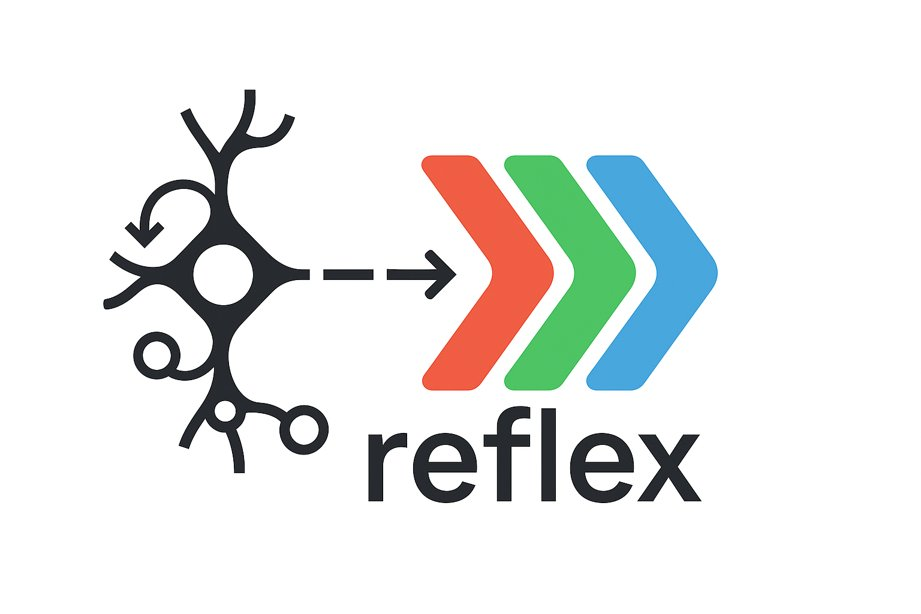

  

**re-frame for the JavaScript world**

A reactive, functional state management library that brings the elegance and power of ClojureScript's re-frame to JavaScript/TypeScript and React/ReactNative applications.

📚 **Want to understand the philosophy behind this approach?** Check out the amazing [re-frame documentation](https://day8.github.io/re-frame/re-frame/) which describes the greatness of this framework in the finest details. Everything you learn there applies to reflex! Though we do lose some of ClojureScript's natural immutability magic. Immer helps bridge this gap, but it's not quite as elegant or efficient as CLJS persistent data structures.

## ✨ Why Reflex?

After many years of building applications with re-frame in the ClojureScript world, I wanted to bring the same architectural elegance to the JavaScript/TypeScript ecosystem. Reflex is not just another state management library—it's a **battle-tested** pattern that promotes:

🎯 **Predictable State Management** - Unidirectional data flow with pure functions  
🧩 **Composable Architecture** - Build complex apps from simple, reusable pieces  
🔄 **Reactive Subscriptions** - UI automatically updates when state changes  
🌐 **Multi-Platform Support** - With effects separation, it's super easy to support multiple platforms with the same codebase, including web, mobile, and desktop  
🤖 **AI Friendly** - Reviewing AI-generated changes is easier because all logic is expressed through pure, isolated functions, making each change understandable, verifiable, and deterministic.  
🛠️ **Integrated DevTools** - [`@flexsurfer/reflex-devtools`](https://github.com/flexsurfer/reflex-devtools) provides deep visibility into your app’s state, events, and subscriptions in real time, forming a powerful combo with Reflex for effective development and debugging.  
⚡ **Interceptor Pattern** - Powerful middleware system for cross-cutting concerns  
🛡️ **Type Safety** - Full TypeScript support with excellent IDE experience  
🧪 **Testability** - Pure functions make testing straightforward and reliable  

## 📚 Learn More

- [Documentation](https://reflex.js.org/docs/)
- [Step-by-Step Tutorial](https://reflex.js.org/docs/quick-start.html)
- [Best Practices](https://reflex.js.org/docs/api-reference.html)
- [API Reference](https://reflex.js.org/docs/best-practices.html)
- [re-frame Documentation](https://day8.github.io/re-frame/re-frame/) - The original and comprehensive guide to understanding the philosophy and patterns

- Examples
  - [TodoMVC](https://github.com/flexsurfer/reflex/tree/main/examples/todomvc) - Classic todo app implementation showcasing core reflex patterns
  - [Einbürgerungstest](https://github.com/flexsurfer/einburgerungstest/) - German citizenship test app built with reflex ([Live Demo](https://www.ebtest.org/))

## 🤝 Contributing

Contributions are welcome! Please feel free to submit a Pull Request or file an issue with questions, suggestions, or ideas.

## 📄 License

MIT © [flexsurfer](https://github.com/flexsurfer)

---

*Bringing the wisdom of ClojureScript's re-frame to the JavaScript world. Now your React applications can enjoy the same architectural benefits that have made re-frame a joy to work with for over a decade.* 