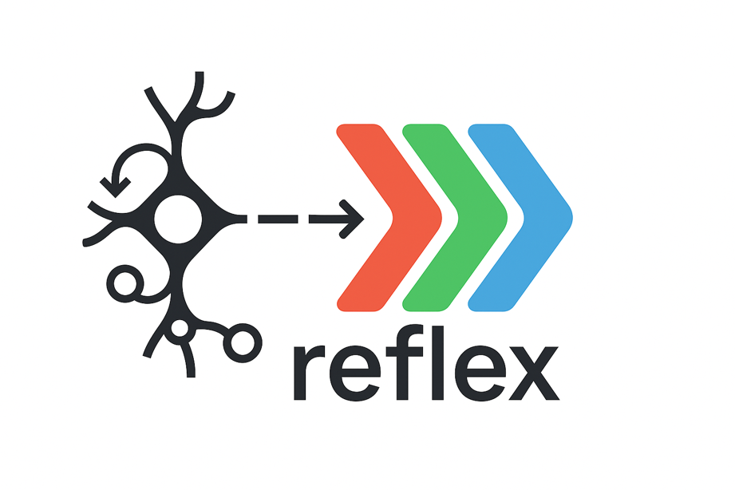

<div align="center">
  
</div>

**re-frame for the JavaScript world**

A reactive, functional state management library that brings the elegance and power of ClojureScript's re-frame to JavaScript and React/ReactNative applications.

[](https://opensource.org/licenses/MIT)
[](https://www.npmjs.com/package/@flexsurfer/reflex)
[](https://github.com/flexsurfer/reflex/pulls)

📚 **Want to understand the philosophy behind this approach?** Check out the amazing [re-frame documentation](https://day8.github.io/re-frame/re-frame/) which describes the greatness of this framework in the finest details. Everything you learn there applies to reflex! Though we do lose some of ClojureScript's natural immutability magic. Immer helps bridge this gap, but it's not quite as elegant or efficient as CLJS persistent data structures.

## ✨ Why Reflex?

After many years of building applications with re-frame in the ClojureScript world, I wanted to bring the same architectural elegance to the JavaScript/TypeScript ecosystem. Reflex is not just another state management library—it's a battle-tested pattern that promotes:

🎯 **Predictable State Management** - Unidirectional data flow with pure functions  
🧩 **Composable Architecture** - Build complex apps from simple, reusable pieces  
🔄 **Reactive Subscriptions** - UI automatically updates when state changes  
⚡ **Interceptor Pattern** - Powerful middleware system for cross-cutting concerns  
🛡️ **Type Safety** - Full TypeScript support with excellent IDE experience  
🧪 **Testability** - Pure functions make testing straightforward and reliable  

## 🚀 Quick Start

```bash
npm install @flexsurfer/reflex
```

### Basic Example

```typescript
import { 
  initAppDb, 
  regEvent, 
  regSub, 
  dispatch, 
  useSubscription 
} from '@flexsurfer/reflex';

// Initialize your app database
initAppDb({ counter: 0 });

// Register events (state transitions)
regEvent('increment', ({ draftDb }) => {
  draftDb.counter += 1; 
});

regEvent('decrement', ({ draftDb }) => {
   draftDb.counter -= 1; 
});

// Register subscriptions (reactive queries)
regSub('counter');

// React component
const Counter = () => {
  const counter = useSubscription<number>(['counter']);
  
  return (
    <div>
      <h1>Count: {counter}</h1>
      <button onClick={() => dispatch(['increment'])}>+</button>
      <button onClick={() => dispatch(['decrement'])}>-</button>
    </div>
  );
}
```

## 🏗️ Core Concepts

### Events & Effects

Events define state transitions and may declare side effects:

```typescript
// Simple state update
regEvent('set-name', ({ draftDb }, name) => {
   draftDb.user.name = name;
});

// Dispatch with parameters
dispatch(['set-name', 'John Doe']);

// Event with side effects
regEvent('save-user', ({ draftDb }, user) => {
  draftDb.saving = true; 
  return [
    ['http', {
      method: 'POST',
      url: '/api/users',
      body: user,
      onSuccess: ['save-user-success'],
      onFailure: ['save-user-error']
    }]
  ]
});

// Dispatch with parameters
dispatch(['save-user', { id: 1, name: 'John', email: 'john@example.com' }]);
```

### Subscriptions

Create reactive queries that automatically update your UI:

```typescript
regSub('user');
regSub('display-prefix');
regSub('user-name', (user) => user.name, () => [['user']]);

// Computed subscription with dependencies
regSub('user-display-name',
  (name, prefix) => `${prefix}: ${name}`,
  () => [['user-name'], ['display-prefix']]
);

// Parameterized subscription
regSub(
  'todo-by-id',
  (todos, id) => todos.find(todo => todo.id === id),
  () => [['todos']]
);

regSub(
  'todo-text-by-id',
  (todo, _id) => todo.text,
  (id) => [['todo-by-id' id]]
);

// Use in React components
function UserProfile() {
  const name = useSubscription<string>(['user-display-name']);
  const todo = useSubscription(['todo-by-id', 123])
  const todoText = useSubscription(['todo-text-by-id', 123]);
  
  return <div>{name}</div>;
}
```

### Effects & Co-effects

Handle side effects in a controlled, testable way:

```typescript
import { 
  regEffect,
  regCoeffect
} from '@flexsurfer/reflex';

// Register custom effects
regEffect('local-storage', (payload) => {
  localStorage.setItem(payload.key, JSON.stringify(payload.value));
});

// Use in events
regEvent('save-to-storage', (_coeffects, data) => {
  return [['local-storage', { key: 'app-data', value: data }]]
});

// Dispatch with data parameter
dispatch(['save-to-storage', { user: 'John', preferences: { theme: 'dark' } }]);

// Register co-effects
regCoeffect('timestamp', (coeffects) => {
  coeffects.timestamp = Date.now();
  return coeffects;
});

regCoeffect('random', (coeffects) => {
  coeffects.random = Math.random();
  return coeffects;
});

// Use co-effect in events
regEvent('log-action', 
  ({ draftDb, timestamp, random }, action) => {
    draftDb.actionLog.push({
      action,
      timestamp: timestamp,
      id: random.toString(36)
    });
  },
  [['timestamp'], ['random']] 
);

// Dispatch with action parameter
dispatch(['log-action', 'some-action']);
```

### Interceptors

Compose functionality with interceptors:

```typescript
const loggingInterceptor = {
  id: 'logging',
  before: (context) => {
    console.log('Event:', context.coeffects.event);
    return context;
  },
  after: (context) => {
    console.log('Updated DB:', context.coeffects.newDb);
    return context;
  }
};

regEvent('my-event', handler, [loggingInterceptor]);
```

## 🎯 Why Re-frame Pattern?

The re-frame pattern has proven itself in production applications over many years:

- **Separation of Concerns**: Clear boundaries between events, effects, and subscriptions
- **Time Travel Debugging**: Every state change is an event that can be replayed
- **Testability**: Pure functions make unit testing straightforward
- **Composability**: Build complex features from simple, reusable parts
- **Maintainability**: Code becomes self-documenting and easy to reason about

## 🔄 Migration from Other Libraries

### From Redux

```typescript
// Redux style
const counterSlice = createSlice({
  name: 'count',
  initialState: { value: 0 },
  reducers: {
    increment: (state) => { state.value += 1; }
  }
});

// Reflex style
initAppDb({ count: 0 });
regEvent('increment', ({ draftDb }) => {
   draftDb.count += 1; 
});
regSub('count');
```

### From Zustand

```typescript
// Zustand style
const useStore = create((set) => ({
  count: 0,
  increment: () => set((state) => ({ count: state.count + 1 }))
}));

// Reflex style
initAppDb({ count: 0 });
regEvent('increment', ({ draftDb }) => {
   draftDb.count += 1; 
});
regSub('count');
```

## 📚 Learn More

- [re-frame Documentation](https://day8.github.io/re-frame/re-frame/) - The original and comprehensive guide to understanding the philosophy and patterns
- Step-by-Step Tutorial - TBD
- API Reference - TBD
- Examples
  - [TodoMVC](https://github.com/flexsurfer/reflex/tree/main/examples/todomvc) - Classic todo app implementation showcasing core reflex patterns
  - [Einbürgerungstest](https://github.com/flexsurfer/einburgerungstest/) - German citizenship test app built with reflex ([Live Demo](https://www.ebtest.org/))
- Best Practices - TBD

## 🤝 Contributing

Contributions are welcome! Please feel free to submit a Pull Request or file an issue with questions, suggestions, or ideas.

## 📄 License

MIT © [flexsurfer](https://github.com/flexsurfer)

---

*Bringing the wisdom of ClojureScript's re-frame to the JavaScript world. Now your React applications can enjoy the same architectural benefits that have made re-frame a joy to work with for over a decade.* 