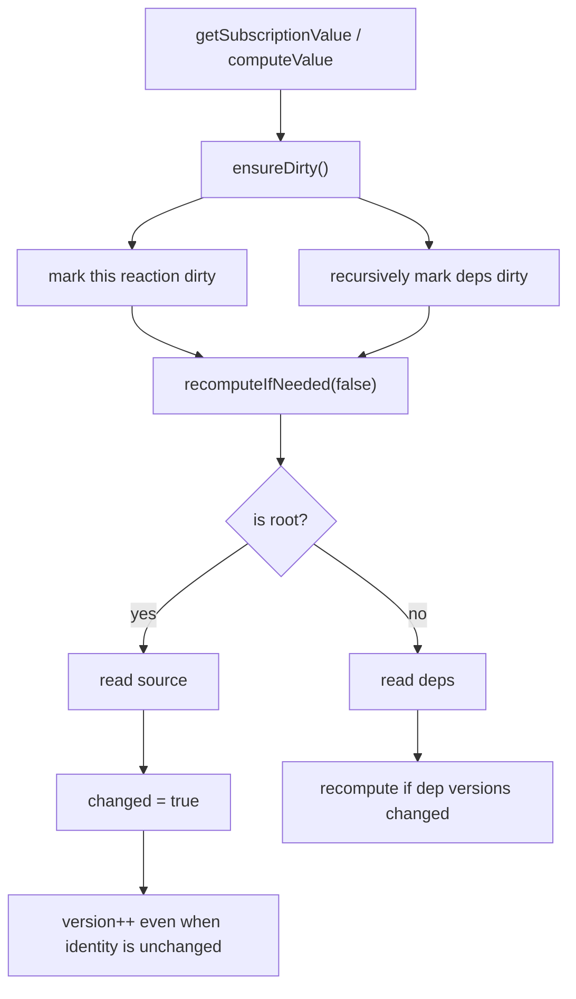
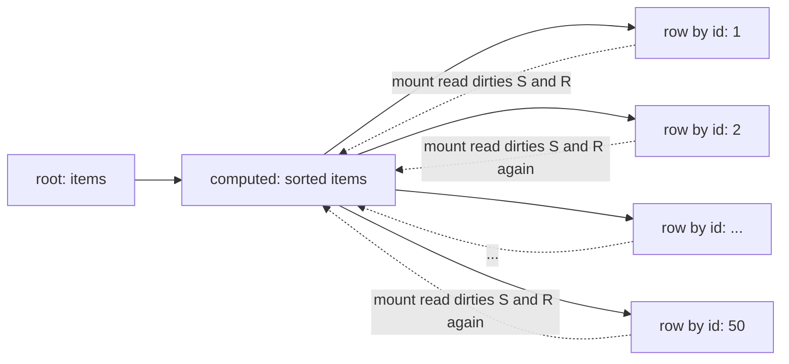
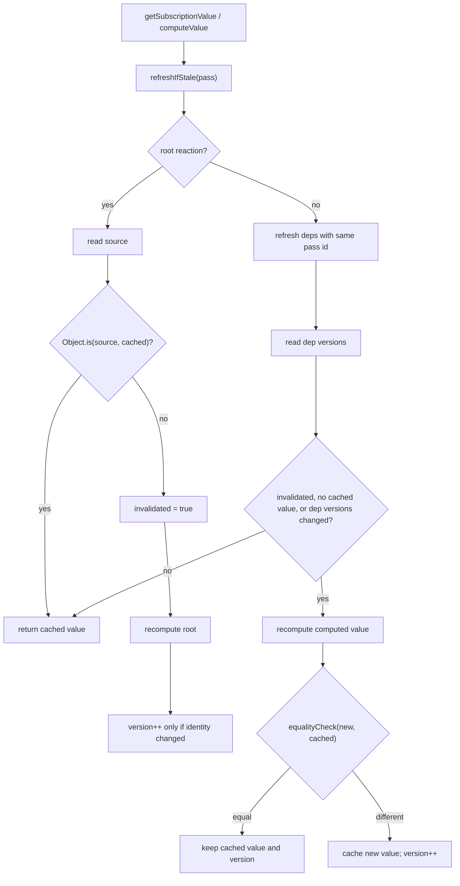
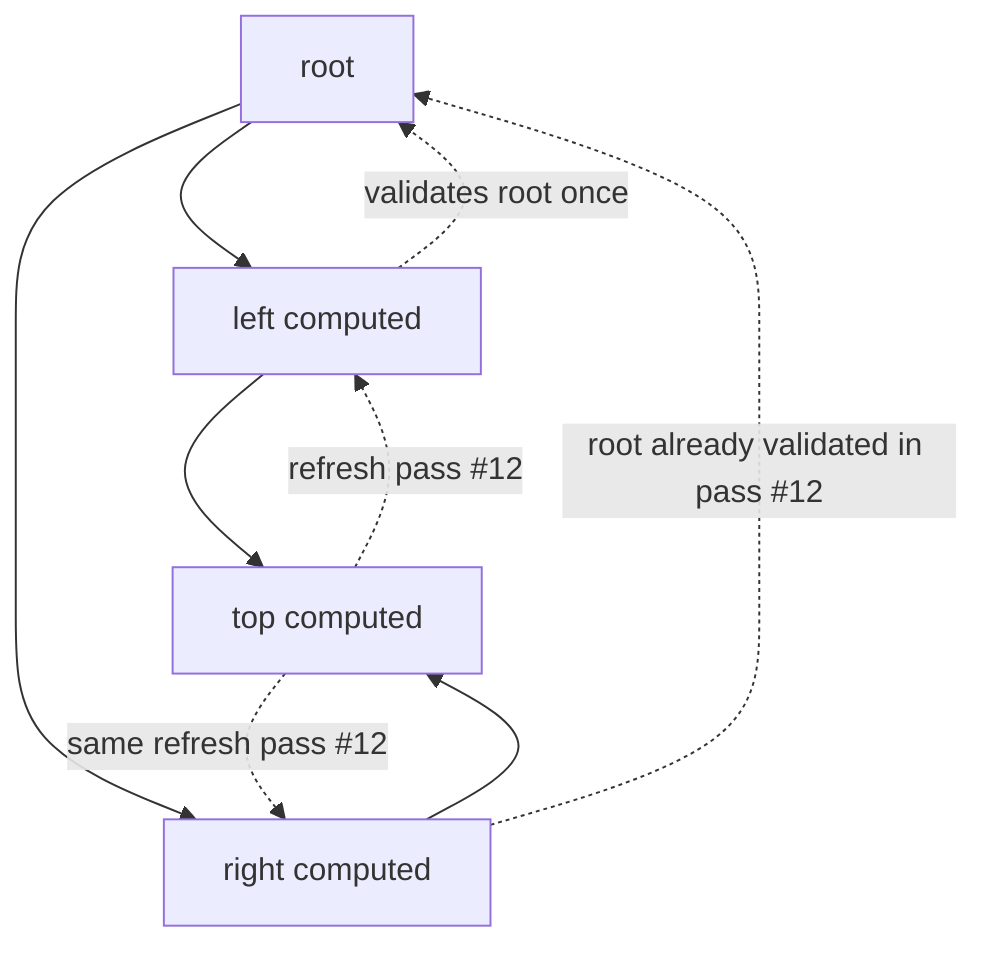
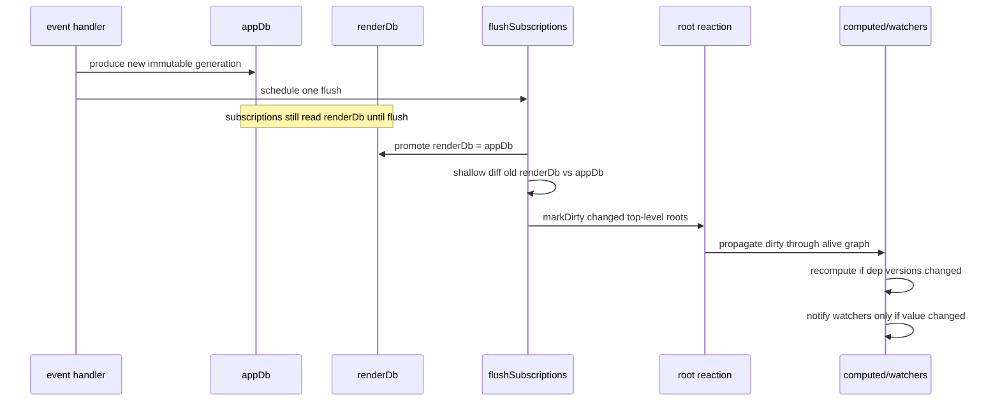

# P1 Runtime Cache Model

This note documents the risky part of P1: replacing the old
`computeValue() -> ensureDirty() -> recomputeIfNeeded()` safety net with a
version/identity based freshness check.

The change is primarily about mount-time performance. The old model was
conservative, but every read could dirty the whole ancestor chain and make
shared parent subscriptions recompute for each newly mounting child. The new
model makes reads validate the cache instead of invalidating it.

## Terms

- `appDb`: the live db generation. Event handlers read it and commit to it.
- `renderDb`: the last flushed db generation. Root subscriptions read it.
- Root reaction: a subscription with no deps, normally one top-level db key.
- Computed reaction: a subscription whose value is derived from dependency
  reactions.
- `hasValue`: whether the reaction has computed at least once. This is
  separate from `value`, because `undefined` is a valid subscription result.
- `version`: monotonic counter on a reaction, bumped only when its cached value
  actually changes.
- `invalidated`: "this node must be checked before it can notify or satisfy a
  dependency read". The public `isDirty` getter is kept as a compatibility
  alias for this internal state.

## Old Read Model

The old `computeValue()` treated every read as suspicious and recursively
marked the whole dependency chain dirty.

### Consequence

Mounting many child subscriptions over one shared parent could re-run the
parent once per child.

That was safe, but it turned the recommended "by-id row subscription over a
shared derived list" pattern into repeated sorts and repeated equality checks.

## New Read Model

`computeValue()` now calls `refreshIfStale()`. The read path validates cache
freshness instead of forcing invalidation.

The `pass` id prevents shared dependencies in a diamond graph from being
validated once per path during a freshness walk.

## Flush Model

Events still dirty the graph from the root downward. The difference is that
the root wake-up no longer depends on Immer patches. The db flush shallow-diffs
the previous render generation against the live generation.

## Safety Contract

The new model is safe under a stricter, explicit contract:

1. `undefined` is a legitimate cached subscription value; `hasValue` tracks
   whether the cache exists.
2. Db writes go through event handlers and Immer drafts.
3. Changed top-level db keys get new object identities from Immer structural
   sharing.
4. Root reaction versions only bump when root value identity changes.
5. Computed reactions trust dependency versions.
6. Equality checks gate propagation after a dependency version bump.
7. Mutable external roots are not a supported invalidation mechanism. If a raw
   `Reaction` returns the same object reference after in-place mutation,
   `markDirty()` does not force dependents to recompute.

The last point is the main semantic change compared with the old safety net.
It is correct for Reflex db subscriptions, because db roots are immutable
snapshots, but it is not the same behavior for arbitrary mutable `Reaction`
usage.

## Regression Coverage

The cache contract is covered by these focused tests:

| Contract | Test |
|---|---|
| Dormant cached subscription refreshes after the db flush | `reaction-cache-contract.test.ts` |
| Before flush, subscriptions still serve the last flushed generation | `reaction-cache-contract.test.ts` and `db-flush.test.ts` |
| Alive child updates through an unwatched shared parent | `reaction-cache-contract.test.ts` |
| Disposed/revived reactions re-resolve dependencies and refresh stale values | `reaction-cache-contract.test.ts` |
| Diamond graph stays correct after a shared root identity change | `reaction-cache-contract.test.ts` |
| Deep equality stops downstream propagation after equal recompute | `reaction-cache-contract.test.ts` |
| `undefined` computed results are cached and can notify on real changes | `reaction-cache-contract.test.ts` |
| Mutable same-reference root mutation is not treated as a change | `reaction-cache-contract.test.ts` |
| Mounting many by-id subscribers computes the shared parent once | `mount-cascade.test.ts` |

## Simplification Options

If this still feels too much for the library's risk budget, the parts can be
separated:

1. Keep conditional patch generation and shallow top-level diff. These are
   performance wins with little public semantic weight.
2. Keep the mount cascade fix, but keep the raw `Reaction` mutable-root semantic
   by adding a root config flag. Db roots could use identity gating; generic
   roots could keep "dirty means changed".
3. Defer `renderDb` if cross-subscription generation consistency is not worth
   the extra mental model right now.
4. Defer `dispatchSync` if the public API timing surface feels too broad for
   the same release.
